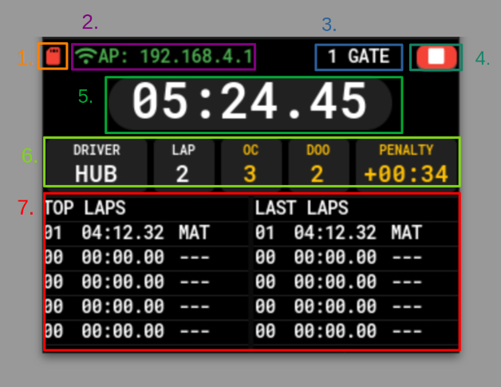

# PUTM EV LAPTIMER

## About
This is standalone laptimer for Formula Student made on ESP32-S3 with ESP-IDF and LVGL. It provides simple way to monitor your lap times during trainings and vehicle tests.

## Features
- Measure lap time using one or two measure gates
- Save lap times on SD card
- Watch lap times on LCD or webpage
- Download .csv files with sorted lap times
- Add penalties from FSG Rules during laptime

## How to use
LCD GUI:
<br/>

1. SD card status
   - RED - not initialized
   - GREEN - initialized
2. WIFI status, mode and IP
   - RED - not initialized
   - GREEN - initialized
   - STA - station mode
   -  AP - access point mode
3. Gate mode
   - 1 GATE - like F1 race finish line, next lap starts automatically 
   - 2 GATES - one gate starts lap, second gate ends lap, then timer stops
4. RUN/STOP
   - RED - lap stopped
   - GREEN - lap in progress
5. Current lap time
6. Current lap info
   - DRIVER - tag of current driver
   - LAP - lap count
   - OC - number of FSG OC penalties
   - DOO - number of FSG DOO penalties
   - PENALTY - cumulated penalty time added to current lap time after finishing
7. Lap time lists
   <br/>
Similar interface can be accessed by connecting to a webpage hosted on ip address displayed on LCD. Moreover, on webpage you can download .csv files with lap times and change system configuration settings:
- Gate mode
- Wifi mode
- SSID and password of wifi network
- Date and time
- List of drivers
Those settings can be also changed by inserting SD card with [config file](firmware/main/config.txt)<br/>
## How to install
1. It's recommended to install ESP-IDF for Visual Studio Code with [this guide](https://github.com/espressif/vscode-esp-idf-extension/blob/master/README.md).
2. After cloning repository you should configure ESP-IDF project using
```
idf.py menuconfig
```
in CLI with activated ESP-IDF or 
```
>ESP-IDF: SDK Configuration Editor (Menuconfig)
```
in VSCode Command Palette, pin assignment and some other settings can be set in (Component config)/(PUTM EV Laptimer).
Default pin assignment is for ESP32-S3 and matches shield hardware used in this project.
<br/><br/>
3. Run
```
idf.py build
```
in CLI or
```
>ESP-IDF: Build Your Project
```
in Command Palette to build project
4. Easy way to quickly rebuild and flash project is to use command
```
>ESP-IDF: Build, Flash and Start a Monitor on Your Device
```
also available from VSCode status bar. You will also see program output in CLI. 
<br/>
